<div align="center">
  
</div>

---

## `01_ABOUT`

> BCA grad in Data Science & Big Data Analytics. I turn ideas into scalable products by combining modern frontends, intelligent backends, and AI capabilities. Currently deep in LLM workflows, agent systems, and autonomy engineering.

---

## `02_TECH_STACK`

| Layer | Technologies |
|-------|-------------|
| **Frontend** |      |
| **Backend** |     |
| **Database** |    |
| **AI / ML** |    `LLMs` `NLP` |
| **Analytics** |    |
| **Tools** |    |

---

## `03_FEATURED_PROJECTS`

<table>
<tr>
<td width="50%">

### 📊 DataPulse
Full-stack MERN analytics platform with interactive dashboards, survey builder, and dataset analysis engine.

`MERN` `DATA VIZ` `SURVEYS`

</td>
<td width="50%">

### 🤖 CareerOS
AI career assistant with resume analysis, skill detection, and personalized guidance chatbot powered by LLMs.

`LLM` `NLP` `AI AGENT`

</td>
</tr>
<tr>
<td width="50%">

### 🚖 CabGPT
NLP-driven cab booking workflow with real-time fare estimation and dynamic pricing insights.

`NLP` `GPT` `PRICING`

</td>
<td width="50%">

### 📈 LinkedIn Growth Agent
Multi-agent AI system with RAG-based context retrieval for autonomous LinkedIn content generation.

`MULTI-AGENT` `RAG` `AUTOMATION`

</td>
</tr>
</table>

---

## `04_CURRENTLY_LOADING`

```
Advanced React & Next.js      ████████████████████░░░░░  75%
AI Agents & LLM Workflows     ████████████████████████░  82%
Cloud & DevOps                ████████████░░░░░░░░░░░░░  48%
System Design                 ██████████████░░░░░░░░░░░  55%
```

---

## `05_CONNECT`

<div align="center">

[](mailto:ss6621841@gmail.com)
[](https://www.linkedin.com/in/saurav-singh19/)
[](https://sauravsinghdev.netlify.app)
[]()

</div>
